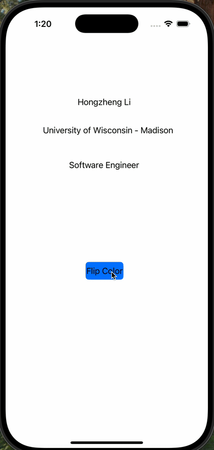

# Prework - *Color Flipping App*

Submitted by: **Hongzheng Li**

**Color Flipping App** is an app that can flip background color of the app with just one click
on the button provided in the lower screen.

Time spent: 1 hours spent in total

## Required Features

The following **required** functionality is completed:

- [x] Users are see a screen with three labels and a button
- [x] Tapping the button changes the screen color to a random color

## Video Walkthrough

## App Brainstorming (Step 4)

- TikTok
    - Algorithmic Recommendations: A highly personalized "For You" page based on user behavior.
    - Easy Content Creation Tools: Built-in video editing, effects, and filters for seamless content creation.
- Google Maps
    - Real-Time Traffic Updates: Accurate live traffic data to plan the best routes
    - Offline Maps: Ability to download maps for navigation without an internet connection.
- Spotify
    - Personalized Playlists: Automatically generated playlists like "Discover Weekly" and "Release Radar" based on listening habits.
    - Offline Playback: Ability to download music and listen without an internet connection.

## Notes

No significant challenges were encountered as the tutorial was very clear and easy to follow.

## License

    Copyright [2024] [Hongzheng Li]

    Licensed under the Apache License, Version 2.0 (the "License");
    you may not use this file except in compliance with the License.
    You may obtain a copy of the License at

        http://www.apache.org/licenses/LICENSE-2.0

    Unless required by applicable law or agreed to in writing, software
    distributed under the License is distributed on an "AS IS" BASIS,
    WITHOUT WARRANTIES OR CONDITIONS OF ANY KIND, either express or implied.
    See the License for the specific language governing permissions and
    limitations under the License.
